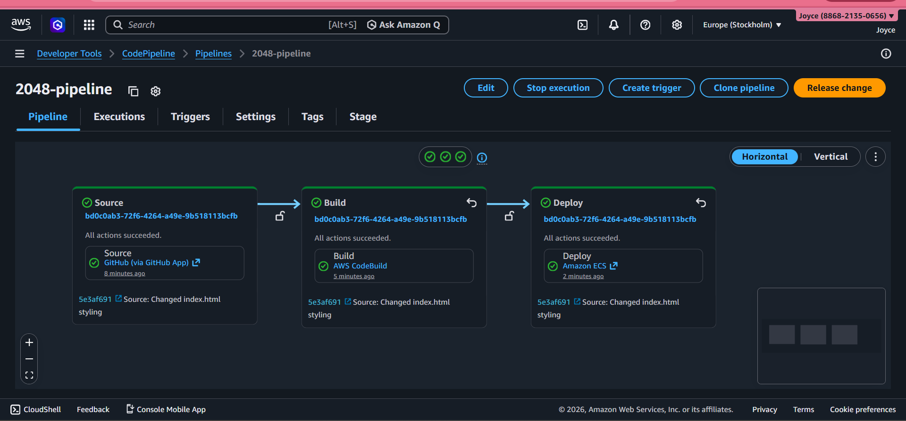
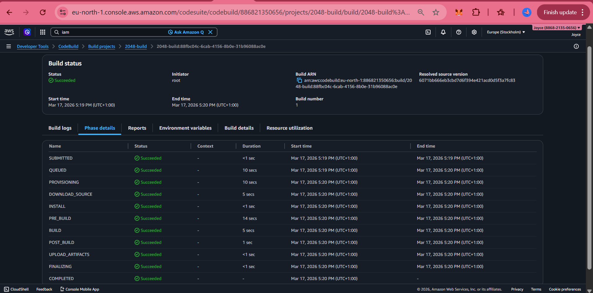
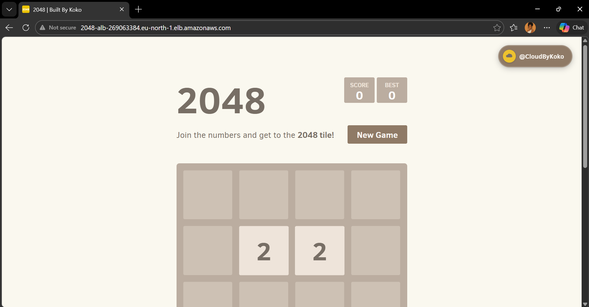

# 🎮 2048 Game — CI/CD Pipeline on AWS

> Automated containerized deployment using AWS CodePipeline, CodeBuild, Amazon ECS (Fargate), and Amazon ECR.

> Forked from [gabrielecirulli/2048](https://github.com/gabrielecirulli/2048) 
> and redeployed as a DevOps portfolio project.


---

## 📌 Project Overview

This project demonstrates a **production-grade CI/CD pipeline** for a containerized static web application. Any code change pushed to GitHub automatically triggers a full build and deployment cycle — no manual steps required.

The application is a containerized and personalized static web app, deployed to AWS ECS Fargate behind an Application Load Balancer.

---

## 🏗️ Architecture

```
Developer pushes code to GitHub
           │
           ▼
  AWS CodePipeline (triggered automatically)
           │
     ┌─────┴─────┐
     │           │
     ▼           ▼
 Source Stage   Build Stage (AWS CodeBuild)
 (GitHub)       │
                ├─ docker build
                ├─ docker tag (latest + build number)
                └─ docker push → Amazon ECR
                         │
                         ▼
                  Deploy Stage (Amazon ECS)
                         │
                         ▼
               ECS Fargate Task (Container)
                         │
                         ▼
            Application Load Balancer (Public URL)
```

---

## 🛠️ AWS Services Used

| Service | Purpose |
|---|---|
| **AWS CodePipeline** | Orchestrates the full CI/CD workflow |
| **AWS CodeBuild** | Builds Docker image and pushes to ECR |
| **Amazon ECR** | Private Docker container registry |
| **Amazon ECS (Fargate)** | Serverless container runtime |
| **Application Load Balancer** | Public-facing HTTP endpoint |
| **Amazon CloudWatch** | Build and container logs |
| **IAM** | Roles and permissions for each service |

---

## 📁 Repository Structure

```
2048/
├── Dockerfile          # Production nginx:alpine container
├── nginx.conf          # Custom nginx config (gzip, caching, security headers)
├── .dockerignore       # Excludes unnecessary files from image
├── buildspec.yml       # AWS CodeBuild instructions
├── taskdef.json        # ECS Fargate task definition
├── index.html          # Game entry point (personalized)
├── style/              # Game stylesheets
└── js/                 # Game logic
```

---

## ⚙️ CI/CD Pipeline Flow

### 1. Source Stage
- CodePipeline monitors the `master` branch via GitHub App connection
- Any `git push` automatically triggers the pipeline

### 2. Build Stage
CodeBuild executes `buildspec.yml` which:
- Authenticates to Amazon ECR
- Builds the Docker image from `Dockerfile`
- Tags the image with both `latest` and the build number (e.g. `1`, `2`, `3`)
- Pushes both tags to ECR
- Outputs `imagedefinitions.json` for the deploy stage



### 3. Deploy Stage
- CodePipeline reads `imagedefinitions.json`
- Updates the ECS service with the new image URI
- ECS performs a rolling deployment with zero downtime
- The ALB target group health check confirms the new container is healthy before completing

---

## 🐳 Docker Configuration

The container uses `nginx:alpine` as the base image with a custom nginx configuration that includes:

- **Security headers** — X-Frame-Options, X-Content-Type-Options, XSS Protection
- **Gzip compression** — for faster asset delivery
- **Aggressive static asset caching** — 1-year cache for JS/CSS/images
- **Short HTML caching** — 5-minute cache so deployments propagate quickly
- **Hidden file protection** — blocks access to `.git`, `.env` etc.

---

## 🚀 How to Run Locally

**Prerequisites:** Docker installed

```bash
# Clone the repo
git clone https://github.com/0seme/2048.git
cd 2048

# Build the image
docker build -t 2048-game .

# Run locally
docker run -d -p 8080:80 --name 2048-local 2048-game

# Open in browser
http://localhost:8080

# Stop and clean up
docker stop 2048-local && docker rm 2048-local
```

---

## 🔑 Key Concepts Demonstrated

- **Infrastructure as Code mindset** — all configuration stored in the repo (`Dockerfile`, `buildspec.yml`, `taskdef.json`, `nginx.conf`)
- **Immutable deployments** — every build produces a versioned image tag, never just overwriting `latest`
- **Separation of concerns** — build logic lives in CodeBuild, deployment logic lives in ECS, orchestration lives in CodePipeline
- **Least privilege IAM** — CodeBuild role scoped to ECR push only, not full admin access
- **Health-check gated deployments** — ALB only routes traffic to containers that pass the health check

---

## 📸 Project Screenshots

> Screenshots documenting the full pipeline from local build to live will be available on my portfolio website when available.

Key evidence captured:
- Local Docker build (11/11 steps)
- ECR repository with versioned image tags
- ECS service health — 1 running, 1 healthy
- CodeBuild phase details — all phases succeeded
- CodePipeline — all 3 stages green
- Pipeline auto-triggered by a git push
- Live application at ALB public URL

---

## 🧹 Teardown

All AWS resources have been deprovisioned after documentation to avoid ongoing costs. Resources deleted: CodePipeline, CodeBuild project, ECS service and cluster, ECR repository, Application Load Balancer, target group, security groups, CloudWatch log groups, S3 artifact bucket, and IAM roles.

---



## 👤 Author

**Joyce (Koko)**
☁️ [@CloudByKoko](https://github.com/0seme)

*Part of an ongoing AWS DevOps portfolio — building toward AWS DevOps Professional certification.*

---

## 📄 License

Original 2048 game by [Gabriele Cirulli](https://github.com/gabrielecirulli/2048) — MIT License.
CI/CD configuration and infrastructure code by Joyce — feel free to reference for your own projects.